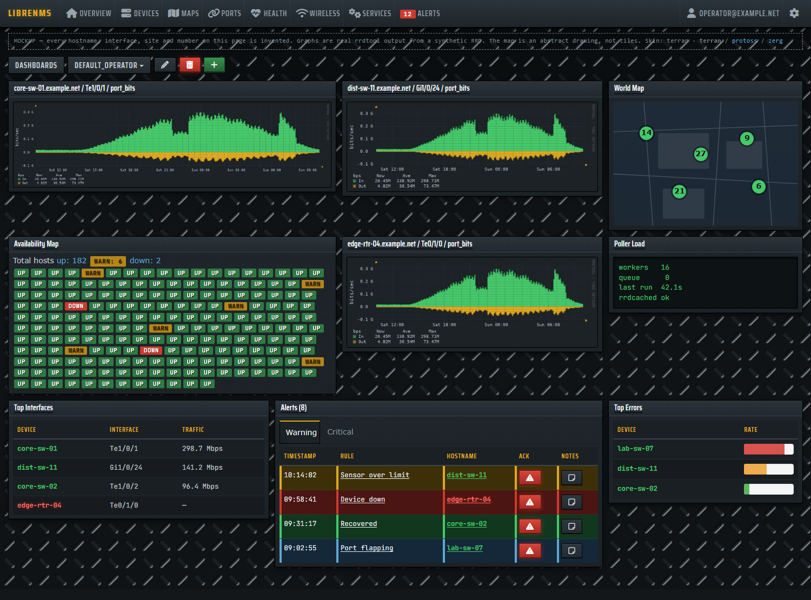
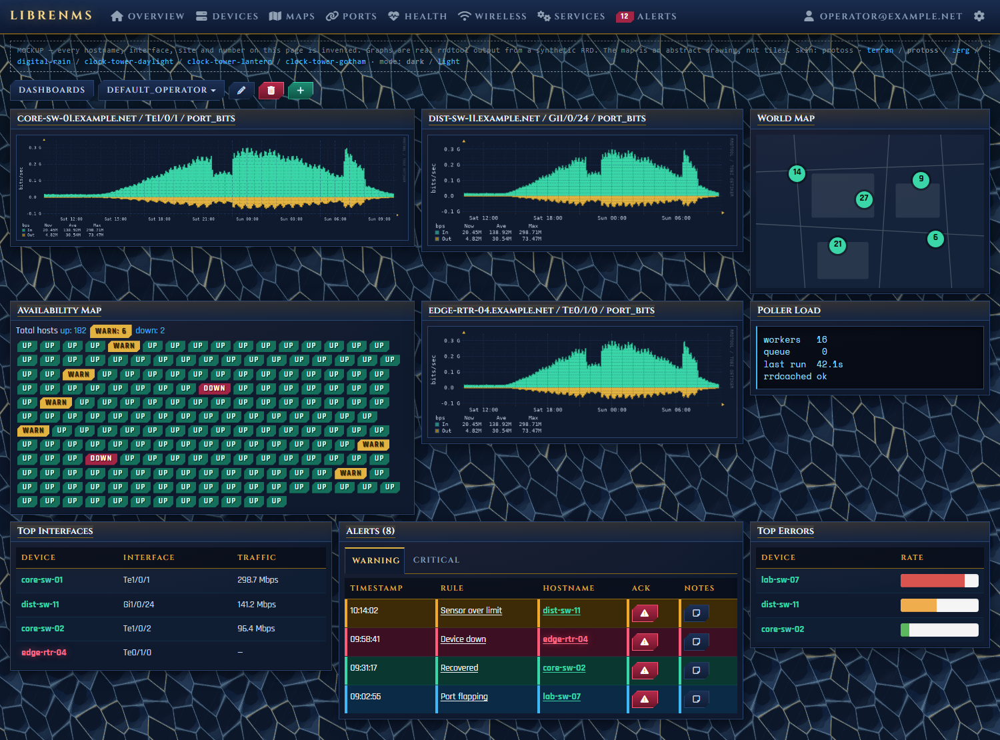
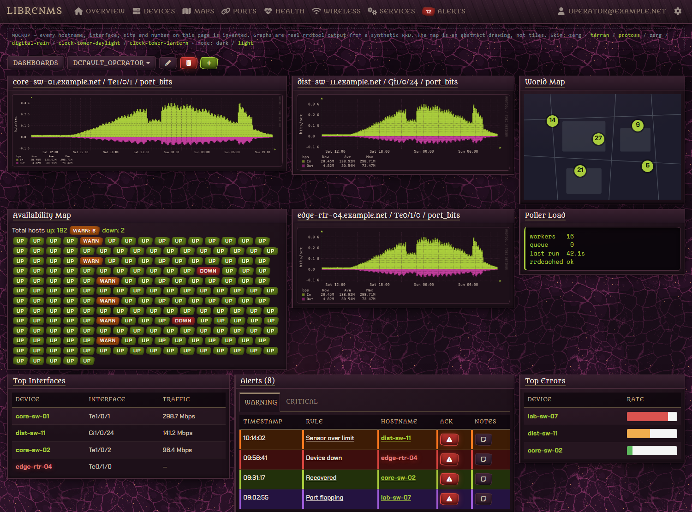

# Theme Selector for LibreNMS

StarCraft-inspired skins for [LibreNMS](https://github.com/librenms/librenms).

Three skins: **Terran**, **Protoss** and **Zerg**.

All artwork is original CSS — gradients, shadows and generated geometry. No
Blizzard assets are used or redistributed. These are "inspired by" skins, not
asset ports.

---

## Status

| Skin | Geometry | Palette | Type |
|---|---|---|---|
| **Terran** | Square, riveted, symmetric | Gunmetal + hazard yellow, red LEDs, green phosphor | Saira Condensed + JetBrains Mono |
| **Protoss** | Chamfered, gold-bracketed | Void blue + keratinous gold, psionic flame | Cinzel + Rajdhani |
| **Zerg** | Asymmetric, grown, uneven | Creep purple + bone, ichor green, ember orange | Metamorphous + Chakra Petch |

All three are installed and verified on a production instance. They cover
**92 of 92** components LibreNMS's dark theme styles, and **183 of 218** once
you also count the `styles.css` classes the dark theme never touches — most of
the remainder being dead Observium-era classes with no references in
`resources/views`.

```bash
./scripts/coverage.sh /opt/librenms          # the floor
```

Coverage counts selectors answered, not whether it looks right — and it does
not count the inline `tw:` utilities at all, which is where several real bugs
lived. The real test is [the live audit](#auditing-a-live-instance), which all
three skins currently pass with zero findings on `/`, `/devices`,
`/alert-rules`, `/eventlog` and the graph pages.

[docs/ROADMAP.md](docs/ROADMAP.md) has the backlog and open decisions.

Verified against LibreNMS master @ `63e0394` (2026-09-17).

---

## What they look like

Each is the same LibreNMS dashboard, same markup, same data — only the skin
differs.

### Terran
Gunmetal plating, hazard yellow, green phosphor readouts. Square and riveted.



### Protoss
Void blue and keratinous gold, chamfered corners, psionic teal.



### Zerg
Creep purple and bone, acid green against ember and magenta. Asymmetric,
uneven, grown rather than built.



**None of these are screenshots of a production instance.** Every hostname,
interface, site and number is invented, and the page says so in its own
header. They are captures of [the offline mockup](#the-dashboard-mockup),
whose markup is read off a live instance so the rendering is faithful. The
graphs are genuine rrdtool output from a synthetic RRD — a real renderer, with
traffic that never existed.

Regenerate them with:

```bash
./scripts/make-demo-graphs.sh     # once; needs rrdtool
python -m http.server 8777
./scripts/capture-mockups.sh      # headless Chrome -> docs/img/
```

Deterministic by construction — fixed window size, fixed device scale factor,
fixed epoch in the synthetic data — so re-running does not churn the repo.

---

## Install

On the LibreNMS host:

```bash
sudo -u librenms git clone https://github.com/XBLOssia/librenms-theme-selector.git /opt/librenms-theme-selector
cd /opt/librenms-theme-selector
./scripts/install.sh zerg
```

Then in the browser: set **Preferences → Theme → Dark** (the skins are an
overlay on the stock dark theme and look broken on the light base), and
hard-refresh.

Substitute `terran` or `protoss` for `zerg`. Add `--dry-run` to preview every
step without changing anything.

**Nothing else to install.** Each skin bundles its own webfonts (~58–77KB of
Latin-subset woff2, all SIL Open Font License). No system fonts to chase, and
no request ever leaves the box.

### Uninstall

```bash
./scripts/uninstall.sh
```

Removes the skin files and restores `webui.custom_css` to whatever it was
before the first install. Or by hand:

```bash
rm -rf /opt/librenms/html/css/custom/{terran,protoss,zerg}
lnms config:clear webui.custom_css
```

### Safety

By default, nothing in LibreNMS core is modified, no schema changes, no
services touched —
the entire footprint is one config row and one directory of static files under
`html/css/custom/`, which is gitignored by LibreNMS. Verified against
`daily.sh`: it updates with `git pull` and `git checkout` and never runs
`git clean`, so the skin survives updates with no patch to reapply.

> `webui.custom_css` is instance-wide. Every user on the instance gets the same
> skin; LibreNMS has no per-user custom theme selection. See
> [docs/FINDINGS.md](docs/FINDINGS.md) §6.

> **One optional exception.** `scripts/patch-core.sh` patches two core files
> so port traffic graphs read their colours from config instead of six
> hard-coded hexes. It is opt-in, byte-identical with no config set, fully
> reversible — and `daily.sh` reverts it on every LibreNMS update, so it has to
> be re-applied. Without it, port graphs stay stock green-and-lavender while
> everything else themes. See [docs/DEPLOYMENT.md](docs/DEPLOYMENT.md).

Full runbook, rollback detail and troubleshooting:
**[docs/DEPLOYMENT.md](docs/DEPLOYMENT.md)**.

---

## Retheming

Each skin is driven entirely by the token block at the top of its stylesheet —
[terran](skins/terran/terran.css) · [protoss](skins/protoss/protoss.css) ·
[zerg](skins/zerg/zerg.css). Change the variables in `:root` and nothing else;
every rule below reads from them, and no rule names a colour or font directly.

This is deliberately the affordance LibreNMS core does not have — see
[docs/FINDINGS.md](docs/FINDINGS.md).

### Typography

Terran uses two voices: `--tn-font-chrome` (condensed caps) for the frame —
navbar, panel headers, table headers, buttons — and `--tn-font-data`
(monospace) for the readouts — device hostnames, table body cells, status
labels and badges. Body cells also get tabular figures so uptimes and counters
align down the column.

Protoss uses the same split, but louder: carved ceremonial capitals for the
frame against a clean futuristic sans for the data. Zerg puts a gnarled organic
display face on the frame and keeps a readable angular sans on the data — the
weirdness lives in the geometry instead, which is what keeps it usable.

All three bundle their faces, so this works with no setup and no external
requests — which matters on an air-gapped NOC box, where a Google Fonts
`@import` would silently degrade exactly where it is least convenient to
debug. Details, sizes, licensing and how to swap a face:
[terran](skins/terran/FONTS.md) · [protoss](skins/protoss/FONTS.md) ·
[zerg](skins/zerg/FONTS.md).

---

## Why these are "skins" and not themes

**And why they will stay skins.** When this was proposed upstream, two
maintainers said installable themes are not wanted — *"LibreNMS isn't
Wordpress"* — and offered the alternative of **selectable built-in colour
schemes hosted in the LibreNMS codebase**
([thread](https://community.librenms.org/t/a-theme-system-for-librenms-a-phased-proposal/29463)). So there is no third-party theme format coming, by choice
rather than by omission, and the upstream path for these three is to become
built-ins rather than to be installed.

LibreNMS has no theme installation system. There is no packaging format, no
distribution story, and no way to register a new theme without patching a core
file that updates overwrite. The two available hooks are:

- `webui.custom_css[]` — an array of stylesheets appended last. Instance-wide,
  not per-user. **This is what these skins use.**
- A `site_style` entry in `resources/definitions/config_definitions.json` —
  gives a per-user dropdown, but that file is core and is overwritten on update.

The plugin system cannot carry a theme. It exposes exactly five hooks
(`DeviceOverviewHook`, `MenuEntryHook`, `PortTabHook`, `SettingsHook`,
`SinglePageHook`), all of which inject content. None publish CSS or assets.

Building these surfaced concrete, measurable problems with theming LibreNMS as
it stands. They are written up in **[docs/FINDINGS.md](docs/FINDINGS.md)** with
reproducible numbers — that document, not the skins, is the interesting output
of this project. **[docs/PROPOSAL.md](docs/PROPOSAL.md)** turns it into a
phased upstream proposal — three small fixes that need no theme system, then
the token work, then built-in colour schemes on top of it.

---

## Test harness

You can preview and verify a skin without a LibreNMS install.

```bash
# one-time: vendor the stylesheets from a LibreNMS checkout
./harness/sync-css.sh /path/to/librenms

python -m http.server 8777
# then open http://localhost:8777/harness/
```

Switch skins with `?skin=terran` / `?skin=protoss` / `?skin=zerg`, or the
buttons at the top of the page. `harness/colorway.html` renders a skin's full
token set and graph ramps.

### The dashboard mockup

`harness/mockup.html` is a LibreNMS dashboard reproduced offline with invented
data — hostnames, interfaces, sites, counts, all fictional. It exists so the
project can be shown without publishing anything from a production instance.

```bash
./scripts/make-demo-graphs.sh          # once; needs rrdtool
python -m http.server 8777
# http://localhost:8777/harness/mockup.html?skin=protoss
```

The markup is read off a running instance rather than guessed, which paid for
itself immediately: the first draft used `.availability-map-oldview-box-*`
(styled by the skins, but not what this LibreNMS renders) and reported three
contrast failures that do not exist on the real page. Widget header colour and
font now match the live DOM exactly.

The graphs are genuine rrdtool output, not CSS imitating a graph.
`scripts/make-demo-graphs.sh` renders them with the same chrome options and
the same in/out ramps the skin ships, from a synthetic RRD on a fixed epoch —
so the PNGs are byte-reproducible and contain no production data.

Two things are deliberately *not* the real thing, and the page says so: the
world map is an abstract drawing (any real tile is a real place), and nothing
is interactive.

### Auditing a live instance

The harness cannot show you a gap it does not contain, so the real test is
**[harness/audit.js](harness/audit.js)** — paste it into devtools on a
logged-in LibreNMS page with a skin active. It reports light surfaces that
should not exist and any text below WCAG AA, measured on what the browser
actually computed.

That is what found the dashboard widget header (its colour lives in a
JavaScript string), the vendored Leaflet cluster markers, 77 icon buttons whose
glyphs the skin had broken, six contrast failures the skins introduced
themselves, and one that core ships — the down-device links, at 3.35:1 on a
table row and 3.01:1 on an alternate row. (A seventh, the `/eventlog` filter
placeholder at 1.2:1, was first listed as core's; it is the skins', and
FINDINGS §2c records the retraction.) A stylesheet-based check saw none of
them.

The harness reproduces LibreNMS's real DOM and loads the real stylesheets in
the real order from `resources/views/layouts/librenmsv1.blade.php`. Vendored
CSS and webfonts are gitignored — LibreNMS is GPLv3 and its assets are not
redistributed here.

---

## Repository layout

```
skins/<name>/<name>.css     the skin - token block at top drives everything
skins/<name>/fonts/         bundled OFL webfonts + licence notices
skins/<name>/FONTS.md       typography rationale and how to swap faces
harness/index.html          static preview, real LibreNMS CSS, real DOM
harness/mockup.html         full dashboard mockup, invented data
harness/graphs/             rrdtool graphs rendered from a synthetic RRD
harness/colorway.html       a skin's tokens and graph ramps, rendered
harness/audit.js            live-page contrast + stock-colour audit
scripts/install.sh          install a skin onto a LibreNMS host
scripts/uninstall.sh        remove skins and restore the previous config
scripts/fetch-fonts.ps1     regenerate the bundled fonts reproducibly
scripts/coverage.sh         report which components no skin has styled yet
scripts/make-demo-graphs.sh generate the mockup's graphs (needs rrdtool)
scripts/capture-mockups.sh  screenshot the mockup per skin, headlessly
scripts/patch-core.sh       optional: let port graphs read their colours
patches/                    that patch, as a reviewable unified diff
docs/img/                   the screenshots above
docs/DEPLOYMENT.md          install/uninstall runbook, persistence, rollback
docs/FINDINGS.md            what building these surfaced about theming LibreNMS
docs/PROPOSAL.md            upstream proposal, ready to post
docs/ROADMAP.md             prioritised backlog and open decisions
```

## Licence

[MIT](LICENSE).

Two carve-outs:

- The bundled webfonts under `skins/*/fonts/` are **SIL Open Font License
  1.1**, with the upstream notice included beside the font files in each
  directory.
- The patch under `patches/` is **GPLv3**, matching LibreNMS, which it is a
  diff against and a small amount of which it quotes as context.

No LibreNMS source is otherwise redistributed here. The harness needs several
of its stylesheets to render anything realistic, and those are fetched at
setup time by `harness/sync-css.sh` into a gitignored directory rather than
committed.
