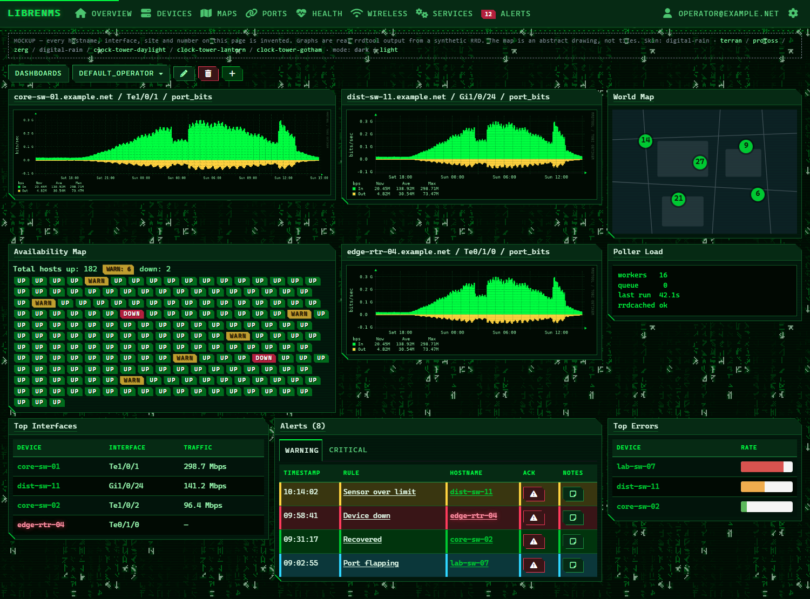
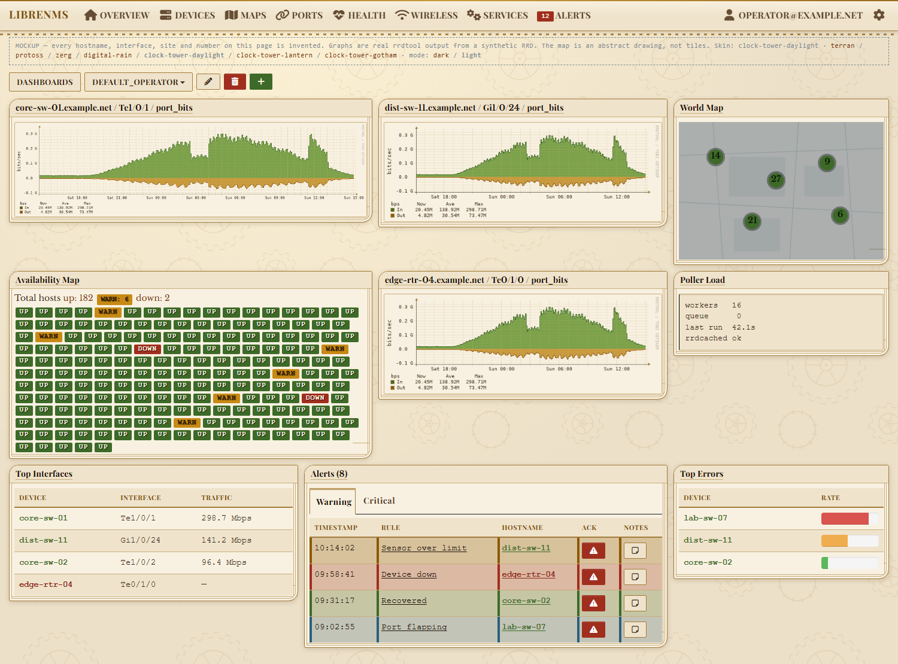
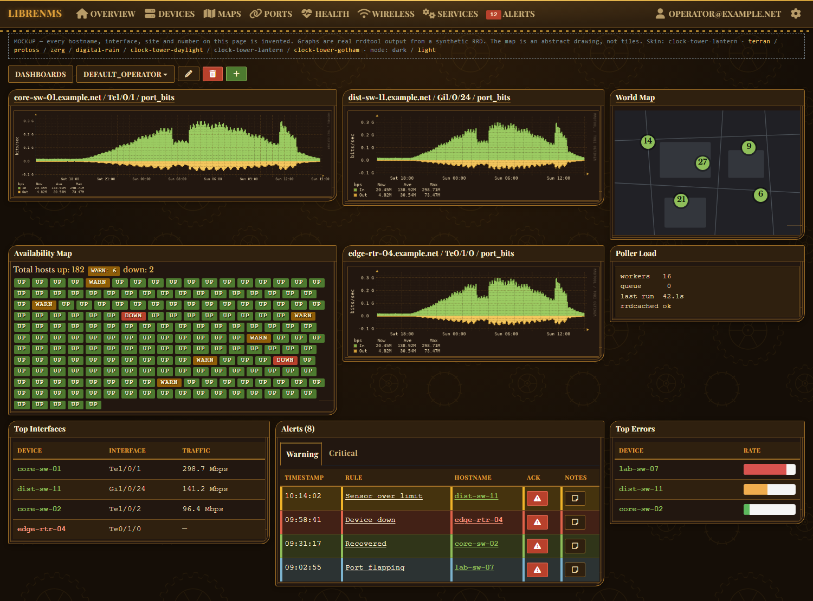
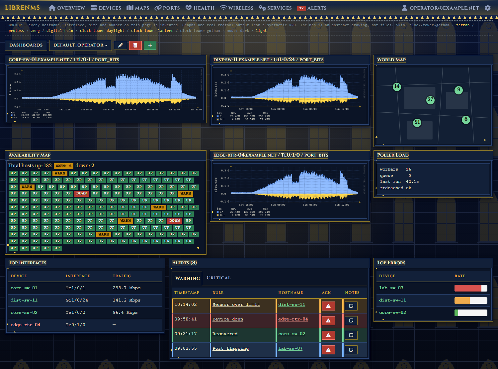
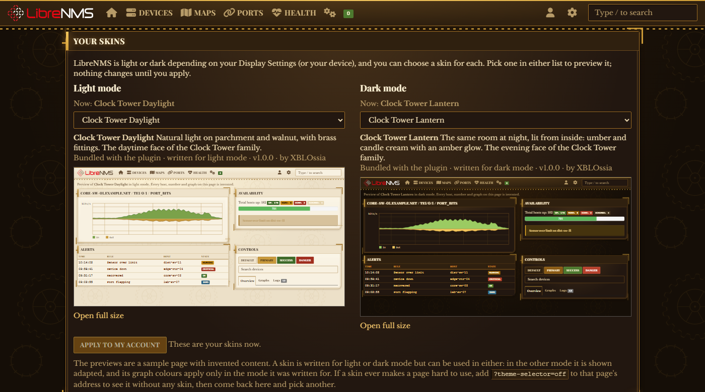

# Theme Selector for LibreNMS

Skins for [LibreNMS](https://github.com/librenms/librenms): three StarCraft-inspired ones, a green-phosphor "digital rain", and a
clock tower in three moods (one light, two dark).

Seven skins in six designs: **Terran**, **Protoss**, **Zerg**, **Digital Rain**, and **Clock Tower** in three
moods: **Daylight** (light mode), **Lantern** (dark mode, lit from inside) and **Gotham** (dark mode, the
great clock at night).

Each user picks a skin for light mode and one for dark mode, from dropdowns that preview each on a
sample page before anything is applied; admins set the instance defaults and can upload
skins of their own (a validated `.zip`, see [docs/AUTHORING.md](docs/AUTHORING.md)),
and graphs follow the skin too, down to the colours of the port traffic series.
Skins can carry a repeating texture, cut corners and frame ornaments
([docs/ORNAMENTS.md](docs/ORNAMENTS.md), [docs/TEXTURES.md](docs/TEXTURES.md)).
It needs PHP 8.2 or newer and a LibreNMS with the package plugin system.

All artwork is original: CSS (gradients, shadows, generated geometry) and one
small PNG texture per skin (diamond plate, crystal, creep, falling glyphs, cogwheels) that
[scripts/make-textures.py](scripts/make-textures.py),
[scripts/make-creep.py](scripts/make-creep.py),
[scripts/make-rain.py](scripts/make-rain.py) and
[scripts/make-clock-tower.py](scripts/make-clock-tower.py) compute from fixed numbers. No
Blizzard assets are used or redistributed. These are "inspired by" skins, not
asset ports.

---

## Status

| Skin | Geometry | Palette | Type |
|---|---|---|---|
| **Terran** | Square, riveted, symmetric | Gunmetal + hazard yellow, red LEDs, green phosphor | Saira Condensed + JetBrains Mono |
| **Protoss** | Chamfered, gold-bracketed | Void blue + keratinous gold, psionic flame | Cinzel + Rajdhani |
| **Zerg** | Asymmetric, grown, uneven | Creep purple + bone, ichor green, ember orange | Metamorphous + Chakra Petch |
| **Digital Rain** | Square, torn corners, scanlined | Phosphor green on black, amber and red for alarms | System monospace (Share Tech Mono when installed) |
| **Clock Tower Daylight** (light) | Double-ruled, leaf-cornered, gilt-bracketed | Parchment, walnut and brass | Playfair Display + Libre Baskerville |
| **Clock Tower Lantern** (dark) | The same room at night | Umber, candle cream, amber glow | The same |
| **Clock Tower Gotham** (dark) | Square stone, pointed arches, quatrefoils | Blue-black stone, lamp yellow | Cinzel (carved capitals) + Libre Baskerville |

Terran, Protoss and Zerg were installed and verified on a production instance (2026-09-29); Digital Rain and the Clock Tower skins have since been installed there too, and had their light/dark and map fixes checked against it.
They cover **92 of 92** components LibreNMS's dark theme styles, and **179 of 218** once
you also count the `styles.css` classes the dark theme never touches — most of
the remainder being dead Observium-era classes. A full survey of
`styles.css` finds 127 rules — 671 lines — that nothing in LibreNMS can match
(see `docs/FINDINGS.md` section 7).

```bash
./scripts/coverage.sh /opt/librenms          # the floor
```

Coverage counts selectors answered, not whether it looks right — and it does
not count the inline `tw:` utilities at all, which is where several real bugs
lived. The real test is [the live audit](#auditing-a-live-instance), which Terran, Protoss, Zerg, Digital Rain and Clock
Tower Lantern and Gotham pass with zero findings on `/`, `/devices`, `/alert-rules`,
`/eventlog` and a device's graph page, and Clock Tower Daylight passes in light mode with one (the disabled
pagination arrows on `/devices`, at 4.0:1). (Re-run on 2026-10-03 against a stock
LibreNMS 26.9.1.1 dev instance, whose tables hold few rows, so row-level states
are lightly exercised; run it on your own data too.)

[docs/ROADMAP.md](docs/ROADMAP.md) has the backlog and open decisions.

Selectors verified against LibreNMS master @ `63e0394` (2026-09-17). Coverage
(92/92, 179/218), the live audit, install, uninstall and graph colours were re-run
on a stock 26.9.1.1 on 2026-10-02.

---

## What they look like

Each is the same LibreNMS dashboard, same markup, same data — only the skin
differs.

### Terran
Gunmetal plating, hazard yellow, green phosphor readouts, on a diamond-plate
floor. Square and riveted.


### Protoss
Void blue and keratinous gold, chamfered corners, psionic teal, over crystal
facets.


### Zerg
Creep purple and bone, acid green against ember and magenta, on veined creep.
Asymmetric, uneven, grown rather than built.


### Digital Rain
Phosphor green on black, a faint scanline over everything, monospace type with a red and cyan
fringe on the headings, and torn corners on panels and buttons. Behind the page, glyphs fall
slowly (one tile every 36 seconds; still for visitors who ask for reduced motion). Amber, not
red, marks outbound traffic on graphs, so it never reads as an alarm. Now and then, on a device
page, something white and quick crosses the bottom corner.



### Clock Tower
A building-mounted clock, in two moods that share one design (a family: pick either for either mode,
or both together). Every panel has a double rule of brass and leaf-shaped corners (two long curves,
two short), gilt brackets with a rivet at the corners, a block of brass beside each heading, a thin
line of brass along the top of the navbar and a row of dentils along its foot, and a faint tile of
cogwheels behind the page. **Daylight** is natural light on parchment and walnut text, for light mode.
**Lantern** is the same room at night, lit from inside: umber surfaces, candle-cream text, an amber
glow on the brass that settles slowly (a nine-second fade, never a flash), for dark mode. Outbound
traffic on graphs is brass and inbound is olive green, which differ in lightness as well as hue.
Type is Playfair Display for headings (with Libre Baskerville's digits, because Playfair's old-style figures turn a 0 into an o) and Libre Baskerville for text, both bundled. Daylight and Lantern are generated from one template by [scripts/make-clock-tower.py](scripts/make-clock-tower.py), which also
checks that every text colour is at least 4.5:1 on its ground, and each is valid as an upload.

**Gotham** is the same tower seen from the street at night, and has a design of its own: a bright yellow
lamp behind the dial, blue stone in shadow, gothic architecture and carved Roman capitals. Panels are
square stone with a double rule and a quatrefoil at each corner; behind every panel heading runs a
faint arcade of pointed arches, lit from below; along the foot of the navbar stand narrow lancet windows,
lit yellow, between piers; and the page is a masonry wall with a tracery window in it, a faint tile
computed from fixed numbers. Headings are Cinzel, the lettering of a Roman inscription (its digits come
from Libre Baskerville Bold, because Cinzel's 1 is a capital I), text is Libre Baskerville, both bundled.
Inbound traffic on graphs is blue and outbound is lamp yellow. It comes from the same script, with a
template of its own.







### Choosing

**Plugins → Theme Selector** has a list for light mode and one for dark mode. Choosing a skin shows it
on a sample page before anything is applied; any skin can go in either list (one written for the
other mode is shown adapted). This is the page with Clock Tower in both: Daylight for light mode,
Lantern for dark. (Captured from the throwaway Docker dev instance, never a real one.)



**None of the dashboard images are screenshots of a production instance.** Every hostname,
interface, site and number is invented, and the page says so in its own
header. They are captures of [the offline mockup](#the-dashboard-mockup),
whose markup is read off a live instance so the rendering is faithful. The
graphs are genuine rrdtool output from a synthetic RRD — a real renderer, with
traffic that never existed.

Regenerate them with:

```bash
./scripts/make-demo-graphs.sh     # once; needs rrdtool
python -m http.server 8777
./scripts/capture-mockups.sh      # headless Chrome -> docs/img/
```

Deterministic by construction — fixed window size, fixed device scale factor,
fixed epoch in the synthetic data — so re-running the capture with the same browser
gives identical files (checked 2026-10-02). The demo graphs are byte-identical only on the
same rrdtool build: another version or font stack draws the same picture with
different bytes, so regenerating them (not the screenshots) can touch the repo.

---

## Install

Theme Selector is a LibreNMS plugin. On the LibreNMS host, as the `librenms`
user in `/opt/librenms`:

```bash
php scripts/composer_wrapper.php config --global repositories.theme-selector '{"type":"vcs","url":"https://github.com/XBLOssia/librenms-theme-selector","no-api":true}'
./lnms plugin:add xblossia/librenms-theme-selector dev-main
./lnms migrate --force
php artisan route:cache
./lnms theme-selector:publish
./lnms theme-selector:status
```

Then **Plugins → Theme Selector**: each user picks a skin for light mode and one for dark mode,
and admins set the instance defaults (what the login page and users who haven't chosen get).
A mode with no skin chosen and no default is stock LibreNMS.

**Updates are automatic.** LibreNMS's own nightly `daily.sh` re-installs every plugin in
`composer.plugins.json`, so the plugin follows `main` with no further steps, migrations
included; `./lnms theme-selector:status` checks it, `scripts/update.sh` does it on demand, and an optional cron
script (`scripts/ensure-installed.sh`) puts the plugin back if a nightly update ever removes it.
How that works, and the one night it can go wrong, is in [docs/DEPLOYMENT.md](docs/DEPLOYMENT.md#updates).

Admins can also add their own skins there as a `.zip`, and remove them again;
see [docs/AUTHORING.md](docs/AUTHORING.md). Uploads are treated as hostile
input (nothing uploaded is ever served, only a stylesheet regenerated from a
strict parse), and [docs/SECURITY.md](docs/SECURITY.md) lists each control, the
test behind it, and what is *not* defended.

**Nothing else to install.** Each skin bundles its own webfonts (~58–77KB of
Latin-subset woff2, all SIL Open Font License). No system fonts to chase, and
no request ever leaves the box.

Updates, uninstalling and troubleshooting: **[docs/DEPLOYMENT.md](docs/DEPLOYMENT.md)**.

### Safety

No LibreNMS core file is modified. The plugin adds two tables of its own (the
instance defaults, and uploaded skins), copies static files into
`html/css/custom/theme-selector/` (gitignored by LibreNMS), and stores each user's
choices (one per mode) in `users_prefs`. Only when an admin sets an instance default does it write
graph-colour rows (`graph_colours.*`, `rrdgraph_def_text*`) into LibreNMS's
config, after recording what they were so it can put them back. It survives
`daily.sh`, which reinstalls plugins after every update and never runs
`git clean`.

> **Graphs follow each user's skin too.** RRDtool draws them on the server
> from config, so on a graph request the plugin overrides the palette in
> memory for that one request. The instance default's palette is what
> LibreNMS stores, for graphs no logged-in user asked for.

> **Port traffic graphs too, still without touching core.** LibreNMS hard-codes the six
> series colours of its port traffic graphs (`generic_data.inc.php`) and reads no config
> for them. The plugin recolours them itself: in web and console processes it wraps LibreNMS's RRD
> store and rewrites exactly those six options just before rrdtool draws, behind a
> reflection check that refuses to install if core's store has changed shape. If core
> ever changes those lines the series fall back to stock colours. See
> [docs/PLUGIN.md](docs/PLUGIN.md). `scripts/patch-core.sh`, an earlier core patch for the
> same job, is no longer needed and is kept only for hosts that applied it; see
> [docs/DEPLOYMENT.md](docs/DEPLOYMENT.md), which also covers updates, uninstalling
> (tested on a clean install) and troubleshooting.

---

## Retheming

A skin is a token file, `skins/<id>/skin.css`: `--ts-*` values that the shared
[base stylesheet](base/base.css) applies to LibreNMS. Every token has a
default, so a skin sets only what it changes. The 20 core roles (surfaces,
text, accent, status colours, fonts, radius) are enough for a complete skin;
[examples/minimal/skin.css](examples/minimal/skin.css) is exactly that. The
full list with defaults is [docs/TOKENS.md](docs/TOKENS.md).

The bundled skins set far more: [terran](skins/terran/skin.css) ·
[protoss](skins/protoss/skin.css) · [zerg](skins/zerg/skin.css) ·
[digital-rain](skins/digital-rain/skin.css) ·
[clock-tower-daylight](skins/clock-tower-daylight/skin.css) ·
[clock-tower-lantern](skins/clock-tower-lantern/skin.css) ·
[clock-tower-gotham](skins/clock-tower-gotham/skin.css). Each also
keeps a private `--p-*` palette its tokens refer to.

### Typography

Terran uses two voices: `--p-font-chrome` (condensed caps) for the frame —
navbar, panel headers, table headers, buttons — and `--p-font-data`
(monospace) for the readouts — device hostnames, table body cells, status
labels and badges. Body cells also get tabular figures so uptimes and counters
align down the column.

Protoss uses the same split, but louder: carved ceremonial capitals for the
frame against a clean futuristic sans for the data. Zerg puts a gnarled organic
display face on the frame and keeps a readable angular sans on the data — the
weirdness lives in the geometry instead, which is what keeps it usable.

Terran, Protoss, Zerg and all three Clock Tower skins bundle their faces, so this works with no setup and no external
requests — which matters on an air-gapped NOC box, where a Google Fonts
`@import` would silently degrade exactly where it is least convenient to
debug. Details, sizes, licensing and how to swap a face:
[terran](skins/terran/FONTS.md) · [protoss](skins/protoss/FONTS.md) ·
[zerg](skins/zerg/FONTS.md) · [clock tower](skins/clock-tower-daylight/FONTS.md). Digital Rain asks for Share Tech Mono and falls back to the
system monospace until that font is bundled.

---

## Why these are "skins" and not themes

**And why they will stay skins.** When this was proposed upstream, two
maintainers said installable themes are not wanted — *"LibreNMS isn't
Wordpress"* — and offered the alternative of **selectable built-in colour
schemes hosted in the LibreNMS codebase**
([thread](https://community.librenms.org/t/a-theme-system-for-librenms-a-phased-proposal/29463)). So there is no third-party theme format coming, by choice
rather than by omission, and the upstream path for these three is to become
built-ins rather than to be installed.

LibreNMS has no theme installation system. There is no packaging format, no
distribution story, and no way to register a new theme without patching a core
file that updates overwrite. The two built-in hooks are:

- `webui.custom_css[]` — an array of stylesheets appended last. Instance-wide,
  not per-user. The skins used this before the plugin.
- A `site_style` entry in `resources/definitions/config_definitions.json` —
  gives a per-user dropdown, but that file is core and is overwritten on update.

The plugin system's five hooks (`DeviceOverviewHook`, `MenuEntryHook`,
`PortTabHook`, `SettingsHook`, `SinglePageHook`) all inject content, and none
publish CSS or assets. A *package* plugin, though, owns a Laravel service
provider, and that can push a stylesheet into every page's `<head>`, per user,
with no core change. That is how Theme Selector works; see
**[docs/PLUGIN.md](docs/PLUGIN.md)**.

Building these surfaced concrete, measurable problems with theming LibreNMS as
it stands. They are written up in **[docs/FINDINGS.md](docs/FINDINGS.md)** with
reproducible numbers — that document, not the skins, is the interesting output
of this project. **[docs/PROPOSAL.md](docs/PROPOSAL.md)** turns it into a
phased upstream proposal — three small fixes that need no theme system, then
the token work, then built-in colour schemes on top of it.

---

## Test harness

You can preview and verify a skin without a LibreNMS install.
`harness/leaks.html` checks that no stock LibreNMS background is still showing
through a skin and that the awkward states (read-only inputs, contextual table
cells) stay readable; run it after any change to `base/base.css`.

```bash
# one-time: vendor the stylesheets from a LibreNMS checkout
./harness/sync-css.sh /path/to/librenms

python -m http.server 8777
# then open http://localhost:8777/harness/
```

Switch skins with `?skin=terran` / `?skin=protoss` / `?skin=zerg` / `?skin=digital-rain` /
`?skin=clock-tower-daylight` / `?skin=clock-tower-lantern` / `?skin=clock-tower-gotham`, or the buttons at the top of the page;
`&mode=light` or `&mode=dark` shows a skin in either mode (it opens in the mode it is written for). (A skin's texture renders only on `mockup.html`;
the other pages load `skin.css` as it is.) `harness/colorway.html` renders a skin's full
token set and graph ramps.

### The dashboard mockup

`harness/mockup.html` is a LibreNMS dashboard reproduced offline with invented
data — hostnames, interfaces, sites, counts, all fictional. It exists so the
project can be shown without publishing anything from a production instance.

```bash
./scripts/make-demo-graphs.sh          # once; needs rrdtool
python -m http.server 8777
# http://localhost:8777/harness/mockup.html?skin=protoss
```

The markup is read off a running instance rather than guessed, which paid for
itself immediately: the first draft used `.availability-map-oldview-box-*`
(styled by the skins, but not what this LibreNMS renders) and reported three
contrast failures that do not exist on the real page. Widget header colour and
font now match the live DOM exactly.

The graphs are genuine rrdtool output, not CSS imitating a graph.
`scripts/make-demo-graphs.sh` renders them with the same chrome options and
the same in/out ramps the skin ships, from a synthetic RRD on a fixed epoch —
so the PNGs are byte-reproducible and contain no production data.

Two things are deliberately *not* the real thing, and the page says so: the
world map is an abstract drawing (any real tile is a real place), and nothing
is interactive.

### Auditing a live instance

The harness cannot show you a gap it does not contain, so the real test is
**[harness/audit.js](harness/audit.js)** — paste it into devtools on a
logged-in LibreNMS page with a skin active. It reports light surfaces that
should not exist and any text below WCAG AA, measured on what the browser
actually computed.

That is what found the dashboard widget header (its colour lives in a
JavaScript string), the vendored Leaflet cluster markers, 77 icon buttons whose
glyphs the skin had broken, six contrast failures the skins introduced
themselves, and one that core ships — the down-device links, at 3.35:1 on a
table row and 3.01:1 on an alternate row. (A seventh, the `/eventlog` filter
placeholder at 1.2:1, was first listed as core's; it is the skins', and
FINDINGS §2c records the retraction.) A stylesheet-based check saw none of
them.

The harness reproduces LibreNMS's real DOM and loads the real stylesheets in
the real order from `resources/views/layouts/librenmsv1.blade.php`. Vendored
CSS and webfonts are gitignored — LibreNMS is GPLv3 and its assets are not
redistributed here.

---

## Repository layout

```
composer.json               the LibreNMS package plugin (xblossia/librenms-theme-selector)
src/                        plugin code: provider, picker, publisher, installer, graph palette, settings
src/Graph/                  port traffic series recolouring: RecolouringRrd, PortSeries, PortSeriesSupport
src/Skin/                   the upload validator: zip reader, token-file parser, value grammar, PNG texture reader
routes/, resources/views/   the Theme Selector page
resources/token-catalog.json  which tokens exist, and which uploads may set (generated)
database/migrations/        the plugin's two tables (settings, uploaded skins) and their later columns (five migrations)
tests/                      php tests/run.php: validator, installer, ornaments, port series, fuzzing; mutate.sh
base/base.css               the base stylesheet: token defaults + every rule
base/light.css              light mode only: LibreNMS's stock palette mapped onto a skin's roles (appended to base-light.css)
skins/<name>/skin.css       a skin: token values, private palette, @font-face
skins/<name>/skin.json      manifest: name, description, mode (light or dark), family
skins/<name>/features.json  bundled skins only: opt in to ornaments and page effects (docs/PLUGIN.md)
skins/<name>/graph.conf     graph palette, applied when it's the instance default
skins/<name>/fonts/         bundled OFL webfonts + licence notices
skins/<name>/textures/      the skin's repeating PNG tile (generated; skins/zerg/TEXTURES.md says how)
skins/<name>/FONTS.md       typography rationale and how to swap faces
examples/minimal/           the smallest complete skin (sets only the 20 core roles)
examples/minimal-light/     the same for light mode
harness/index.html          static preview, real LibreNMS CSS, real DOM
harness/mockup.html         full dashboard mockup, invented data
harness/leaks.html          stock backgrounds still showing through, and contrast
harness/graphs/             rrdtool graphs rendered from a synthetic RRD
harness/colorway.html       a skin's tokens and graph ramps, rendered
harness/audit.js            live-page contrast + stock-colour audit
harness/sync-css.sh         vendor LibreNMS's stylesheets for the harness (gitignored)
dev/                        Docker LibreNMS for developing the plugin, its live tests, and test-update.sh (install, nightly update, uninstall on a clean one)
scripts/gen-token-docs.py   regenerate docs/TOKENS.md from base.css
scripts/gen-token-catalog.py  derive the token catalog (settable vs structural) from base.css
scripts/pack-skin.py        zip a skin folder for upload
scripts/update.sh           update the plugin now and check it (what daily.sh does overnight)
scripts/ensure-installed.sh optional cron safety net: put the plugin back if a nightly update removed it
scripts/fetch-fonts.ps1     regenerate the bundled fonts reproducibly
scripts/make-textures.py    compute the plate, crystal and tile textures
scripts/make-creep.py       compute the Zerg creep texture
scripts/make-rain.py        compute the Digital Rain glyph tile
scripts/make-clock-tower.py write the three Clock Tower skins (and their cogwheel and tracery tiles)
scripts/coverage.sh         report which components no skin has styled yet
scripts/dead-css.py         find styles.css rules nothing can match (docs/data/ holds the list)
scripts/helper-audit.py     which graph helpers hard-code colours (FINDINGS section 5)
scripts/make-demo-graphs.sh generate the mockup's graphs (needs rrdtool)
scripts/capture-mockups.sh  screenshot the mockup per skin, headlessly
scripts/daily-wrapper.sh    legacy: daily.sh with the old core patch out of the way (see DEPLOYMENT.md)
scripts/patch-core.sh       legacy, not needed: the old core patch for port graph colours
patches/                    that patch (and the older two-file declaration it removes), as unified diffs
docs/img/                   the screenshots above
docs/PLUGIN.md              plugin design, decisions and phases
docs/TOKENS.md              token reference (generated)
docs/AUTHORING.md           writing a skin: files, rules, fonts, graph colours
docs/ORNAMENTS.md           frame ornaments, cut corners, motion: the rules and the reasons
docs/TEXTURES.md            repeating textures: format, limits, how the tiles are made
docs/SECURITY.md            uploaded skins: threat model, controls, what isn't defended
docs/DEPLOYMENT.md          install, updates, migration, uninstall, rollback
docs/FINDINGS.md            what building these surfaced about theming LibreNMS
docs/PROPOSAL.md            upstream proposal, ready to post
docs/ROADMAP.md             prioritised backlog and open decisions
```

## Licence

[MIT](LICENSE).

Two carve-outs:

- The bundled webfonts under `skins/*/fonts/` are **SIL Open Font License
  1.1**, with the upstream notice included beside the font files in each
  directory.
- The patches under `patches/` (legacy, see above) are **GPLv3**, matching LibreNMS,
  which they are diffs against and a small amount of which they quote as context.

No LibreNMS source is otherwise redistributed here. The harness needs several
of its stylesheets to render anything realistic, and those are fetched at
setup time by `harness/sync-css.sh` into a gitignored directory rather than
committed.
